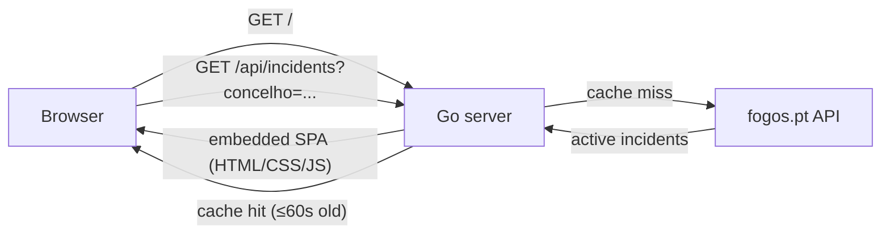

# 🔥 fogos

[](LICENSE)
[](go.mod)
[](https://github.com/rodolfonuneslopes/fogos/pkgs/container/fogos)

A lightweight single-page app that shows **active wildfire occurrences in Portugal**, filterable by district (distrito) and municipality (concelho), backed by [fogos.pt](https://fogos.pt) / ANEPC data.

The Go backend does two jobs: it serves the SPA (embedded directly in the binary) and acts as a thin, caching proxy to the fogos.pt API, so the upstream token never reaches the browser and the upstream service never sees more than one request per concelho per minute.

## Contents

- [Features](#features)
- [Tech stack](#tech-stack)
- [Architecture](#architecture)
- [Project structure](#project-structure)
- [Getting started](#getting-started)
- [Configuration](#configuration)
- [API reference](#api-reference)
- [Testing](#testing)
- [Deployment](#deployment)
- [License](#license)

## Features

- **District/concelho filtering** — dropdowns are populated dynamically from whatever incidents are currently active, no static district→concelho mapping to maintain.
- **Grouped by status** — incidents are bucketed into collapsible sections (Em Curso, Despacho de 1º Alerta, Em Resolução, Vigilância, Conclusão), sorted by severity and then by resources deployed. Expanded/collapsed state survives auto-refresh.
- **Auto-refresh** — polls every 60s, pauses via the Page Visibility API when the tab isn't active, and links out to the fogos.pt detail page for each incident.
- **Mock mode** — `FOGOS_MOCK=true` serves realistic fake incidents with no network calls, for offline frontend work (see [Configuration](#configuration)).
- **Good API citizenship** — server-side response cache (60s TTL) plus [singleflight](https://pkg.go.dev/golang.org/x/sync/singleflight) request coalescing, so a burst of concurrent browser requests for the same concelho triggers at most one upstream call.
- **Hardened by default** — CSP, `X-Frame-Options`, `Referrer-Policy`, `Permissions-Policy`, HSTS, and tuned read/write/idle timeouts on every response.
- **Zero-build frontend** — vanilla JS + [Pico CSS](https://picocss.com/), no bundler, no framework, no `node_modules` in production.
- **Minimal footprint** — compiles to a single static binary and ships as a [distroless](https://github.com/GoogleContainerTools/distroless), non-root Docker image.

## Tech stack

| Layer | Choice |
|---|---|
| Backend | Go 1.25, standard library `net/http` only (no web framework) |
| Concurrency | `golang.org/x/sync/singleflight` for cache-miss request coalescing |
| Frontend | Vanilla JS (ES modules), [Pico CSS v2](https://picocss.com/) (red theme) — no framework, no build step |
| Static assets | Embedded into the binary via Go's `embed.FS` |
| Backend tests | `go test`, offline against fixtures — no network calls |
| Frontend tests | Node's built-in test runner (`node --test`); pure logic (sorting/grouping/filtering) is split into `logic.js` so it's testable without a DOM |
| Container | Multi-stage `Dockerfile` → `gcr.io/distroless/static-debian12:nonroot` |
| CI/CD | GitHub Actions — publishes tagged images to GHCR on every `v*.*.*` tag |
| Deployment target | Designed to run behind a Cloudflare Tunnel (public TLS terminated at the edge) |

## Architecture



The browser never talks to fogos.pt directly — it only ever calls the Go server, which holds the upstream auth token (if any) and the response cache.

## Project structure

```
cmd/server/            entrypoint — env parsing, http.Server construction
internal/fogos/        upstream API client + interface + mock implementation
internal/handler/      routing, request handlers, TTL cache, security headers
internal/handler/web/  embedded SPA assets (index.html, app.js, logic.js, styles.css)
test/frontend/         Node-based unit tests for logic.js
implementation-docs/   deep-dive docs: deployment, security, performance (see below)
```

## Getting started

### Prerequisites

- [Go 1.25+](https://go.dev/dl/) — only needed to run/build from source.
- Docker — only needed for the container-based options below.

The fogos.pt API is public and requires no token, so the simplest way to run is:

```bash
make run
```

The server listens on `:8888` by default (override with `LISTEN_ADDR`).

### Run with Docker

Pull the published image and run it directly — no Go toolchain needed:

```bash
docker run --rm -p 8888:8888 ghcr.io/rodolfonuneslopes/fogos:latest
```

Or build it from source:

```bash
docker build -t fogos:local .
docker run --rm -p 8888:8888 fogos:local
```

Pass any of the [Configuration](#configuration) environment variables with `-e`, e.g. `-e FOGOS_MOCK=true`.

### Run with Docker Compose

```bash
docker compose up -d
```

See [docker-compose.yml](docker-compose.yml) — it pulls the published image by default; uncomment `build: .` to build from source instead. Edit the `environment:` block to switch modes or set a `FOGOS_TOKEN`.

### Make targets

| Target | Description |
|--------|-------------|
| `make run` | Format, vet, and run the server |
| `make build` | Compile the `fogos` binary |
| `make test` | Run backend (Go) and frontend (Node) tests |
| `make test-go` | Run Go tests only |
| `make test-js` | Run frontend logic tests only |
| `make fmt` | Format source with `gofmt` |
| `make vet` | Run `go vet` |

## Configuration

All configuration is via environment variables — see [.env.example](.env.example).

| Variable | Default | Description |
|---|---|---|
| `LISTEN_ADDR` | `:8888` | Address the server listens on |
| `FOGOS_BASE_URL` | `https://api.fogos.pt` | Base URL of the upstream fogos.pt API |
| `FOGOS_TOKEN` | _(unset)_ | Optional upstream auth token, sent as `FOGOS-PT-AUTH` header. Never exposed to the browser |
| `FOGOS_MOCK` | `false` | When `true`, bypasses the upstream API entirely and serves fake data |

Three modes fall out of these variables:

| Mode | How to activate |
|---|---|
| Real API, no auth | (nothing set — the default) |
| Real API, with auth token | `FOGOS_TOKEN=your_token` |
| Mock (no network calls) | `FOGOS_MOCK=true` |

**Mock mode** returns fake incidents for every concelho and is useful for UI development without any network dependency. Most concelhos return two sample incidents; selecting **Évora** returns an empty list so you can see the "no active fires" state.

## API reference

The frontend consumes two endpoints served by the Go backend; both are also usable directly.

### `GET /api/incidents`

| Query param | Required | Description |
|---|---|---|
| `concelho` | no | Filter to one municipality. Must match an entry from `/api/concelhos`, otherwise `400 Bad Request` |

Returns a JSON array of incidents (`Cache-Control: public, max-age=60`):

```json
[
  {
    "id": "mock-001",
    "concelho": "Castelo Branco",
    "freguesia": "São Miguel",
    "district": "Castelo Branco",
    "status": "Em Curso",
    "statusCode": 5,
    "natureza": "Incêndio Rural",
    "date": "01-07-2026",
    "hour": "14:32",
    "man": 47,
    "terrain": 12,
    "aerial": 2,
    "meios_aquaticos": 0,
    "detailLocation": "São Miguel. Castelo Branco. Portugal (EN18 Km 12)",
    "extra": "16:00 - EN18 cortada ao trânsito"
  }
]
```

`statusCode` drives both sort order and the badge color in the UI:

| Code | Status | Meaning |
|---|---|---|
| 5 | Em Curso | Active — highest priority |
| 4 | Despacho de 1º Alerta | First alert dispatched |
| 7 | Em Resolução | Being brought under control |
| 9 | Vigilância | Under watch |
| 8 | Conclusão | Concluded |

### `GET /api/concelhos`

Returns the static list of all Portuguese municipalities used to populate/validate the `concelho` filter (`Cache-Control: public, max-age=86400`).

## Testing

```bash
make test        # everything
make test-go      # Go: upstream client edge cases (empty/null/malformed/error responses),
                  # cache + singleflight coalescing, concelho validation, security headers
make test-js      # Node: incident sorting, status grouping, district/concelho filtering
```

## Deployment

Deeper operational write-ups live in [implementation-docs/](implementation-docs/):

- [INITIAL_DEPLOYMENT.md](implementation-docs/INITIAL_DEPLOYMENT.md) — first production rollout notes.
- [KUBERNETES_DEPLOYMENT.md](implementation-docs/KUBERNETES_DEPLOYMENT.md) — running fogos on Kubernetes.
- [image-publishing.md](implementation-docs/image-publishing.md) — how/when container images get built and pushed to GHCR.
- [SECURITY_HARDENING.md](implementation-docs/SECURITY_HARDENING.md) — the reasoning behind the security headers and timeouts.
- [PERFORMANCE_OPTIMIZATIONS.md](implementation-docs/PERFORMANCE_OPTIMIZATIONS.md) — the reasoning behind the cache/singleflight design.

## License

[Apache License 2.0](LICENSE).

Wildfire data courtesy of [fogos.pt](https://fogos.pt) / ANEPC. Styled with [Pico CSS](https://picocss.com/).
